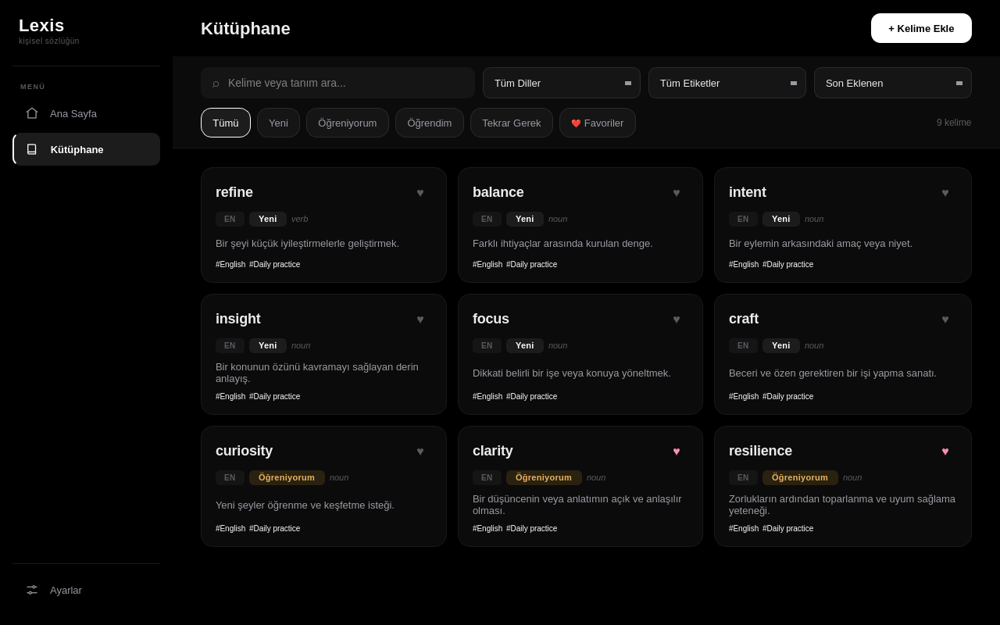
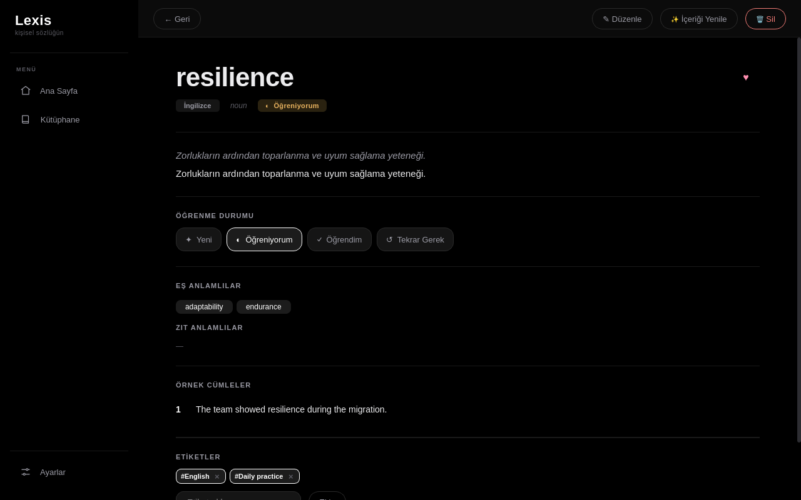

# Lexis

[English](#english) · [Türkçe](#türkçe)



## English

A local-first desktop dictionary for collecting words and practising them with spaced repetition. Lookups use open dictionary services without an API key; Gemini assistance is optional.

### Features

- Library with search, tags, favourites, learning states, and editable word entries.
- Definitions, examples, synonyms and pronunciation from open sources where available.
- SM-2 practice, review tracking, import/export, and a local SQLite database.
- Python + PyQt6; available on the AUR as `lexis-git`.

### Getting started

Install from source with Python 3.10+. On Arch Linux, `yay -S lexis-git` is an alternative.

```bash
git clone https://github.com/talhacaglar/Lexis.git
cd Lexis
python -m venv .venv
source .venv/bin/activate
pip install -e .
lexis
```

Words and preferences are stored in `~/.lexis/lexis.db`. Fetching new entries requires a network connection; saved vocabulary remains local. Add a Gemini key from Settings only if you want AI assistance. On Windows, activate the environment with `.venv\Scripts\activate`.



[Detailed technical reference](REFERENCE.md)

## Türkçe

Kelimeleri kaydetmek ve aralıklı tekrarla çalışmak için local-first masaüstü sözlüğü. Kelime aramaları API anahtarı gerektirmeyen açık sözlük servislerini kullanır; Gemini desteği isteğe bağlıdır.

### Özellikler

- Arama, etiket, favori, öğrenme durumu ve düzenlenebilir kelime kayıtları içeren kütüphane.
- Açık kaynaklarda bulunduğunda anlam, örnek cümle, eş anlamlı ve telaffuz bilgisi.
- SM-2 alıştırmaları, tekrar takibi, içe/dışa aktarma ve yerel SQLite veritabanı.
- Python + PyQt6; AUR üzerinde `lexis-git` paketi.

### Başlangıç

Python 3.10+ ile kaynak koddan kurun. Arch Linux üzerinde alternatif olarak `yay -S lexis-git` kullanılabilir.

```bash
git clone https://github.com/talhacaglar/Lexis.git
cd Lexis
python -m venv .venv
source .venv/bin/activate
pip install -e .
lexis
```

Kelimeler ve tercihler `~/.lexis/lexis.db` içinde saklanır. Yeni içerik almak internet bağlantısı gerektirir; kaydedilmiş kelimeler yerelde kalır. AI desteği isterseniz Ayarlar bölümünden Gemini anahtarı ekleyin. Windows üzerinde ortamı `.venv\Scripts\activate` ile etkinleştirin.

[Ayrıntılı teknik referans](REFERENCE.md)
